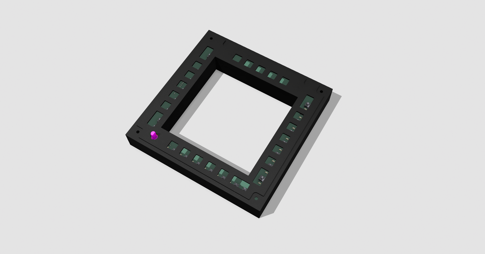
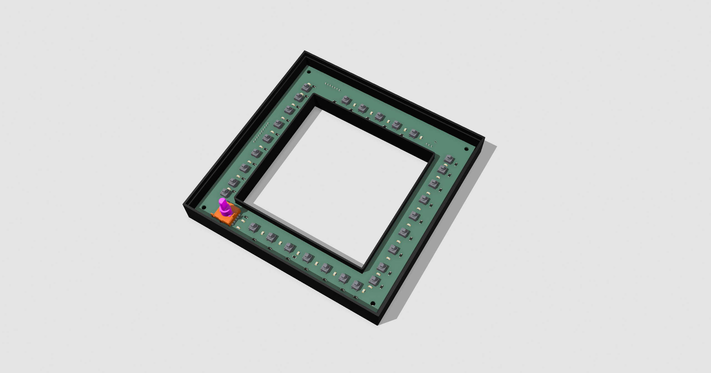
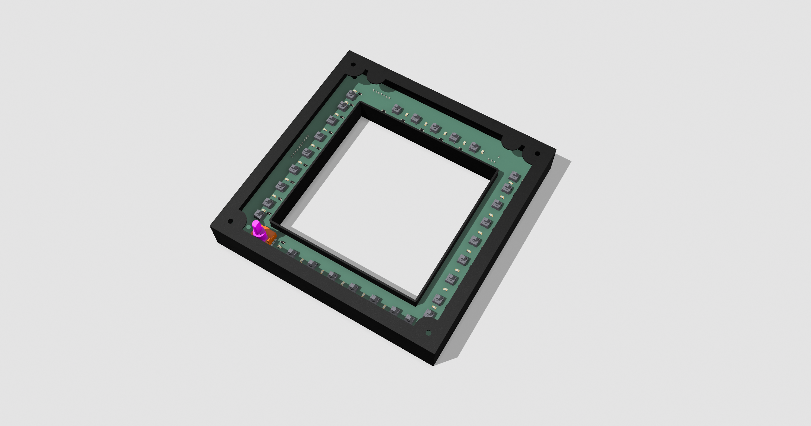

# A10C-II MFCD Case

Here is my case design. Designed with Shapr3D.

This is still work in progress, although the most basic stuff is already here.

## Contents
- [A10C_MFCD.shapr](./A10C_MFCD.shapr) - Shapr3D design files for case and buttons.
- [A10C_MFCD_Prints.3mf](./A10C_MFCD_Prints.3mf) - Ready to use case project for 3d printing.

## How to assemble

Just snap the `UpperLid` and `Lid` together (some force required). Insert PCB into the case, screw together - done! :-)

## Things to do
- [ ] Better/more spacers for PCB. It flexes too much.
- [ ] Multicolor for white/translucent text and borders
- [ ] 2-way switch design (like UFC)
- [ ] Gray height adjust for 3-way switch (DAY/NT/OFF) selector. (The gray part below the knob.)

## Images
### Bottom

### Lid

### UpperLid
