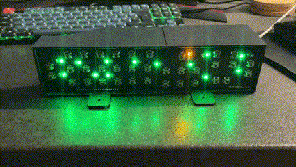
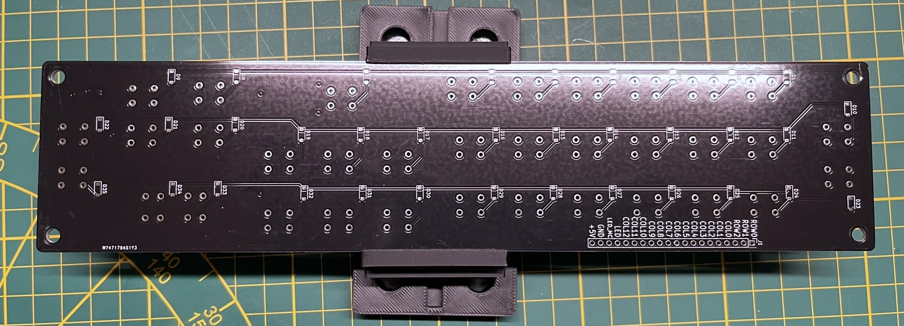
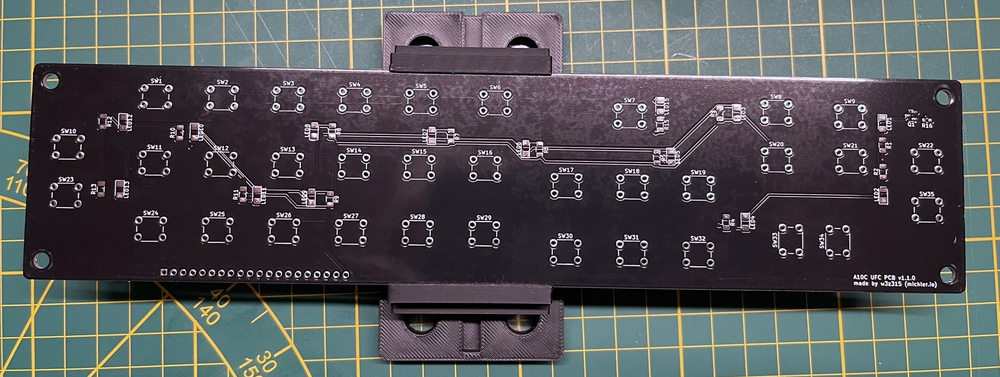
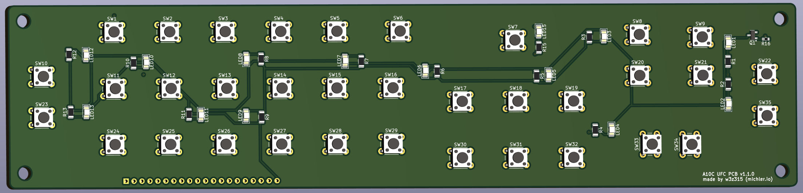
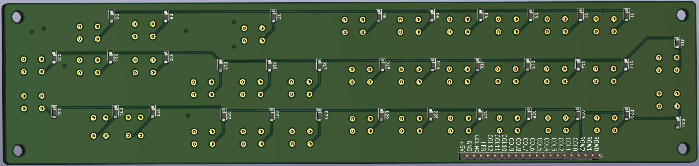

# A-10C Upfront Control Panel (UFC) PCB

Welcome to the repository for my very first PCB design, crafted specifically for an A-10C cockpit simulator project. This project has been a labor of love, a lot of learning, and yes, a few missteps - but that's the beauty of DIY!

## Demo Video

Check out the demo video to see the A10C UFC in action:

## Sponsorship
Thank you so much [PCBWay.com](https://pcbway.com) for sponsoring this project! I was genuinely surprised by how quickly the PCBs arrived - in just 9 days, without even opting for the very express shipping variant. The quality is outstanding, and the PCBs work flawlessly in my setup. It's been a fantastic experience, from design submission to receiving the boards ready for assembly.

## About the Project
The A-10C UFC PCB is for my custom A-10C cockpit control panel.

## Todos:
- [ ] Add more backlight LEDs so the bottom row is better illuminated.
- [ ] Add another yellow LED for the Master Caution to spread out light more evenly.
- [ ] Better connector?

## Arduino Code
You can find the code for the PCB and Arduino Nano at [https://github.com/w3z315/a10c-ufc-arduino](https://github.com/w3z315/a10c-ufc-arduino).

## Repository Contents
Inside this repository, you'll find all the KiCad files used to create the PCB. Feel free to browse through them, use them as a reference, or even contribute to improving the design.

## Images & gifs

)

## Issues and Contributing
If you notice any issues or if you've got suggestions for improvements, don't hesitate to open an issue or a pull request. This project is all about community and collaboration.

## License

This project is licensed under the GNU GPLv3 License - see the [LICENSE](LICENSE) file for details.

## Acknowledgements
- Thanks to the open-source community for providing the tools and resources that made this project possible. (Winks to Kicad 8!)
- PCBWay.com for their sponsorship and assistance.
- A shoutout to all the DIYers and hobbyists who inspire me every day.
- TheWarthogProject.com - dude, you're amazing!

Happy building!
